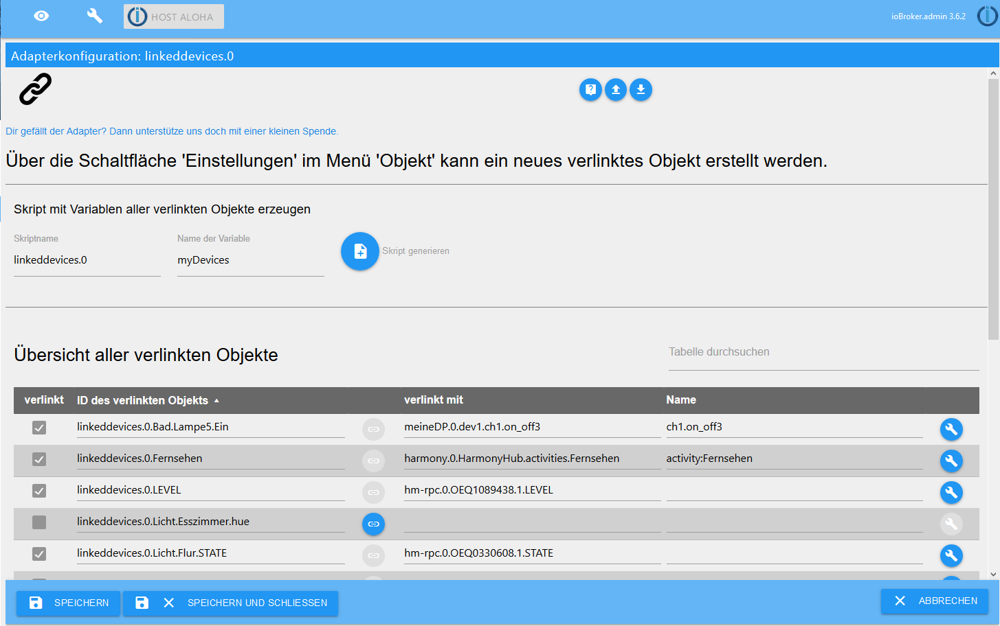
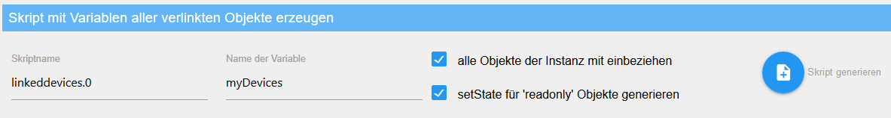
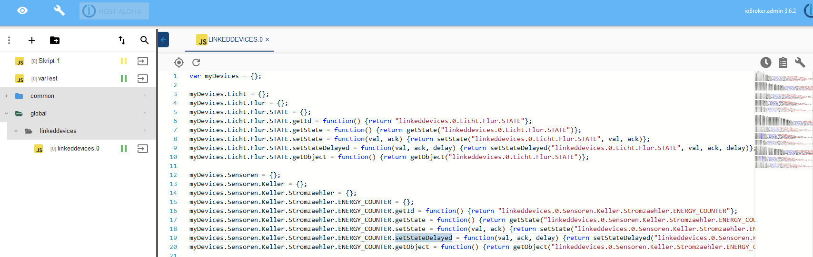
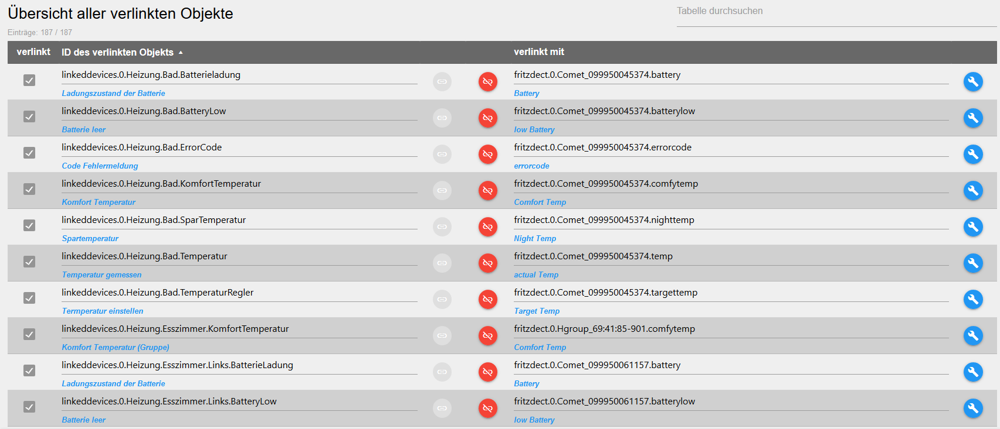
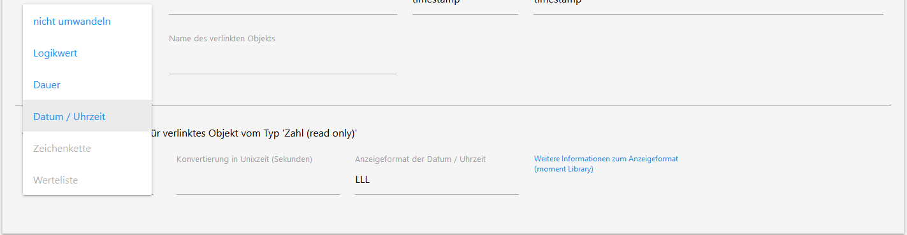
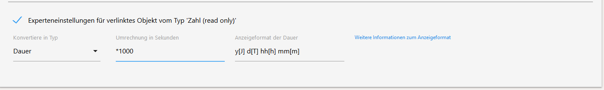
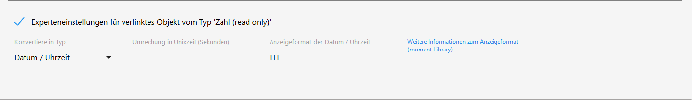
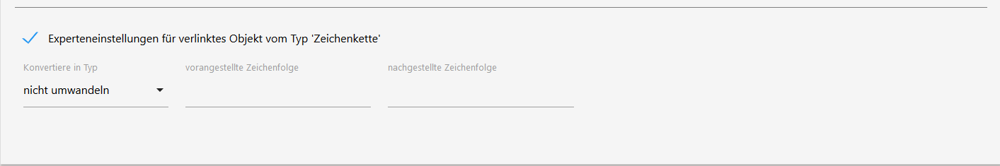
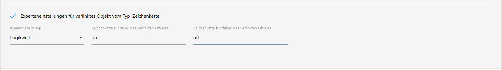
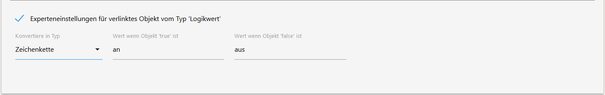

# ioBroker linkeddevices adapter

Mit diesem Adapter ist es möglich eigene Objekte (Datenpunkte) von
Geräten in einer selbst definierten Struktur zu erstellen.
Durch die zentralisierte Darstellung an einem Ort können die Objekte
einfach z.B. in Vis oder Skripten verwendet werden. Weiterhin müssen
z.B. bei einem Hardwareaustausch nur die Verknüpfungen neu erstellt
werden, alle VIS Views und Skripte funktionieren sofort wieder.

Außerdem können mit dem Adapter Objekte in andere Typen konvertiert
werden.

Dieser Adapter ist inspiriert durch das [Virtual Devices Skript von Pman](https://forum.iobroker.net/topic/7751/virtual-devices).

  

## Adapterkonfiguration

### Skript mit Variablen aller verlinkten Objekte erzeugen
In der Adapterkonfiguration kann ein globales Skript erzeugt werden, dass für alle verlinkten Objekte Variablen anlegt.

> Für diese Funktion wird der Adapter [Javascript Script Engine](https://github.com/iobroker/ioBroker.javascript/blob/master/README.md) benötigt

|  Eingabefeld | Beschreibung  |
|---|---|
|Skriptname| Name unter dem das erzeugte Skript abgespeichert wird |
|Name der Variable| Name der Variable über die alle verlinkten Objekte in einem Skript angesteuert werden kann |

Das ganze sieht im Skript Editor dann so aus:

### Übersicht aller verlinkten Objekte

In der Adapterkonfiguration gibt es eine Übersicht über alle verlinkten Objekte bzw. auch Objekte die nicht mehr verlinkt sind.
In der Tabelle kann sortiert und auch nach Begriffen gefiltert werden. 
Weiter können hier nicht mehr verlinkte Objekte wieder mit einem Objekt verlinkt werden und direkt die Einstellung der Objekte, die verlinkt sind, geöffnet werden.

 

## Objekt (Datenpunkt) verlinken
Ein Objekt (Datenpunkt) kann über den Button `Einstellungen` im Menü
`Objekt` erstellt werden.

## Objekt (Datenpunkt) Einstellungen

Die folgenden Grundeinstellungen müssen für das verlinkte Objekt
vorgenommen werden:

|  Eingabefeld | Beschreibung  |
|---|---|
| Aktiviert | die Verlinkung für das Objekt aktivieren |
| Präfix für ID des verlinkten Objektes | Bezeichung die der ID des verlinkten Objektes vorangestellt werden soll |
| ID des verlinkten Objekts | ID des verlinkten Objektes |
| Zusammengesetze ID des verlinkten Objektes | Zeigt an wie die Id des verlinkten Objektes aussehen wird - Zusammensetzung von *Präfix für ID des verlinkten Objektes* & *ID des verlinkten Objekts*

Weiterhin sind noch folgende Einstellungen möglich:

|  Eingabefeld | Beschreibung  |
|---|---|
| Name des verlinkten Objekts | Hier kann ein Name für das verlinkte Objekte festlegt werden |
| Experteneinstellungen für verlinktes Objekt vom Typ 'X' | weitere Einstellungen die abhängig vom Objekttyp sind. ([Zusätzliche Informationen hierzu weiter unten](#experteneinstellungen-für-verlinktes-objekt-vom-typ-x)) <ul><li>[Zahl (readonly)](#experteneinstellungen-für-verlinktes-objekt-vom-typ-zahl-readonly)</li><li>[Zahl](#experteneinstellungen-für-verlinktes-objekt-vom-typ-zahl)</li></ul> |

**Beispiel:** Die oben im Screenshot dargestellten Eingaben erzeugen
das folgende verlinkte Objekt:

 

## Experteneinstellungen für verlinktes Objekt vom Typ X

Abhängig vom Typ (Zahl, Logikwert, Zeichenkette, etc.) des zu verlinkenden
Objektes, können weitere Einstellungen, wie z.B. Umrechnungen oder
Umwandlungen in einen anderen Typ für das verlinkte Objekt eingestellt
werden. Für folgende Typen gibt es derzeit Umwandlungen:

* [Zahl (readonly)](https://github.com/Scrounger/ioBroker.linkeddevices/blob/master/doc/de/README.md#experteneinstellungen-f%C3%BCr-verlinktes-objekt-vom-typ-zahl-readonly)  
* [Zahl](https://github.com/Scrounger/ioBroker.linkeddevices/blob/master/doc/de/README.md#experteneinstellungen-f%C3%BCr-verlinktes-objekt-vom-typ-zahl)
* [Zeichenkette](https://github.com/Scrounger/ioBroker.linkeddevices/blob/master/doc/de/README.md#experteneinstellungen-f%C3%BCr-verlinktes-objekt-vom-typ-zeichenkette)
* [Logikwert](https://github.com/Scrounger/ioBroker.linkeddevices/blob/master/doc/de/README.md#experteneinstellungen-f%C3%BCr-verlinktes-objekt-vom-typ-logikwert)

 

## Experteneinstellungen für verlinktes Objekt vom Typ 'Zahl (readonly)'

### Zahl (readonly): Konvertiere in Typ 'nicht umwandeln'

|  Eingabefeld | Beschreibung  | erlaubte Eingabe | Beispiel (siehe Bild) |
|---|---|---|---|
| Ändere Einheit 'X' in | Einheit für das verlinkte Objekt festlegen | keine Beschränkung | Objekt hat Einheit 'kWh', verlinktes Objekt hat Einheit 'Wh' |
| max. Anzahl der Nachkommastellen | max. Anzahl der Nachkommastellen für das verlinkte Objekt festlegen | Zahlen | Wert des Objekts '100.561' ergibt für das verlinkte Objekt den Wert '101' |
| Ändere min 'X' in | minimaler Wert der das verlinkte Objekt annehmen darf | Zahlen | - |
| Ändere max 'X' auf | maximaler Wert der das verlinkte Objekt annehmen darf | Zahlen | - |
| Umrechnung für verlinktes 'read' Objekt | mathematische Umrechnung des Wertes des Objektes | _+ - / *,. ()_ & *Zahlen* | Wert des Objektes '279688.9' mit Umrechnung '/1000' zeigt beim verlinkten Objekt den Wert '280.6889' an |

### Zahl (readonly): Konvertiere in Typ 'Logikwert'

|  Eingabefeld | Beschreibung  | erlaubte Eingabe | Beispiel (siehe Bild) |
|---|---|---|---|
| Bedingung 'true' für verlinktes Objekt | Wert des Objektes, für den das verlinkte Objekt auf 'true' gesetzt werden soll | *= != > < >= <=* + *Zahlen* | Für Werte '>100' des Objekt ist das verlinkte Objekt 'true' |

### Zahl (readonly): Konvertiere in Typ 'Dauer'
Zur Info beim Typ 'Dauer' ist das verlinkte Objekt vom Typ 'Zeichenkette'

|  Eingabefeld | Beschreibung  | erlaubte Eingabe | Beispiel (siehe Bild) |
|---|---|---|---|
| Umrechnung in Sekunden | Zur Berechnung der Dauer muss der Wert in Sekunden vorliegen. Liegt der Wert z.B. in Millisekunden vor, so müsst ihr '/1000' eintragen. Wenn er z.B. in Stunden vorliegt, dann müsst ihr '/3600' eintragen | _/ *_ & *Zahlen* | - |
| Anzeigeformat der Dauer | Hier könnt ihr die Formatierung für die Dauer festlegen | [siehe moment duration format library Doku](https://github.com/jsmreese/moment-duration-format#template-string) | 'y[J] d[T] hh[h] mm[m]' zeigt beim verlinkten Objekt den Wert '1J 11T 00h 24m' an, sofern ioBroker Sprache auf Deutsch eingestellt ist |

### Zahl (readonly): Konvertiere in Typ 'Datum / Uhrzeit'
Zur Info beim Typ 'Datum / Uhrzeit' ist das verlinkte Objekt vom Typ 'Zeichenkette'

|  Eingabefeld | Beschreibung  | erlaubte Eingabe | Beispiel (siehe Bild) |
|---|---|---|---|
| Umrechung in Unixzeit (Sekunden) | Zur Berechnung von Datum und oder Uhrzeit muss der Wert in der [Unixzeit](https://de.wikipedia.org/wiki/Unixzeit) vorliegen. Liegt der Wert z.B. in Millisekunden vor, so müsst ihr '/1000' eintragen. Wenn er z.B. in Stunden vorliegt, dann müsst ihr '/3600' eintragen | _/ *_ & *Zahlen* | - |
| Anzeigeformat der Datum / Uhrzeit | Hier könnt ihr die Formatierung für das Datum und oder Uhrzeit festlegen | [siehe moment library Doku](https://momentjs.com/docs/#/parsing/string-format/) | 'LLL' zeigt beim verlinkten Objekt den Wert '26. Juli 2019 22:01' an, sofern ioBroker Sprache auf Deutsch eingestellt ist |

  

## Experteneinstellungen für verlinktes Objekt vom Typ 'Zahl'

### Zahl: Konvertiere in Typ 'nicht umwandeln'

|  Eingabefeld | Beschreibung  | erlaubte Eingabe | Beispiel (siehe Bild) |
|---|---|---|---|
| Ändere Einheit 'X' in | Einheit für das verlinkte Objekt festlegen | keine Beschränkung | Objekt hat keine Einheit, verlinktes Objekt hat Einheit '%' |
| max. Anzahl der Nachkommastellen | max. Anzahl der Nachkommastellen für das verlinkte Objekt festlegen | Zahlen | Wert des Objekts '100.561' ergibt für das verlinkte Objekt den Wert '101' |
| Ändere min 'X' in | minimaler Wert der das verlinkte Objekt annehmen darf | Zahlen | - |
| Ändere max 'X' auf | maximaler Wert der das verlinkte Objekt annehmen darf | Zahlen | - |
| Umrechnung für verlinktes Objekt | mathematische Umrechnung des Wertes des Objektes | _/ *,._ & *Zahlen* | Wert des Objektes '180' mit Umrechnung '*100/255' zeigt beim verlinkten Objekt den Wert '71' an. Umgekehrt wird der Kehrwert bei der Berechnung gebildet, d.h. wenn das verlinkte Objekt den Wert '71' hat, hat das Objekt den Wert '180'. Das kann z.B. für Hue Lampen verwendet werden, um den Wertebereich von '0-255' in '0%-100%' umzuwandeln |

### Zahl: Konvertiere in Typ 'Logikwert'

|  Eingabefeld | Beschreibung  | erlaubte Eingabe | Beispiel (siehe Bild) |
|---|---|---|---|
| Bedingung 'true' für verlinktes Objekt | Wert des Objektes, für den das verlinkte Objekt auf 'true' gesetzt werden soll | *= != > < >= <=* + *Zahlen* | Für Werte '>30' des Objekt ist das verlinkte Objekt 'true' |
| Wert wenn verlinktes Objekt 'true' ist | Wert des Objektes wenn das verlinkte Objekt 'true' ist | Zahlen | Wird das verlinkte Objekt auf 'true' gesetzt, wird der Wert des Objektes '30' |
| Wert wenn verlinktes Objekt 'false' ist | Wert des Objektes wenn das verlinkte Objekt 'false' ist | Zahlen | Wird das verlinkte Objekt auf 'false' gesetzt, wird der Wert des Objektes '10' |

  

## Experteneinstellungen für verlinktes Objekt vom Typ 'Zeichenkette'

### Zeichenkette: Konvertiere in Typ 'nicht umwandeln'

|  Eingabefeld | Beschreibung  | erlaubte Eingabe | Beispiel (siehe Bild) |
|---|---|---|---|
| vorangestellte Zeichenfolge | Ein Zeichefolge die beim verlinkten Objekt vor die Zeichfolge des Objektes gesetzt wird | alles | Hat das Objekt den Wert 'ich bin ein Zeichenkette', dann hat das verlinkte Objekt den Wert 'prefix_ich bin ein Zeichenkette' |
| nachgestellte Zeichenfolge | Ein Zeichefolge die beim verlinkten Objekt hinter die Zeichfolge des Objektes gesetzt wird | alles | Hat das Objekt den Wert 'ich bin ein Zeichenkette', dann hat das verlinkte Objekt den Wert 'ich bin ein Zeichenkette_suffix' |

### Zeichenkette: Konvertiere in Typ 'Logikwert'

|  Eingabefeld | Beschreibung  | erlaubte Eingabe | Beispiel (siehe Bild) |
|---|---|---|---|
|Zeichenkette für 'true' des verlinkten Objekts| Zeichenkette für das das verlinkte Objekt 'true' wird. Diese wird auch umgekehrt verwendet - wenn das verlinkte Objekt 'true' wird, wird der Wert des Objektes die angebene Zeichenkette| Zeichenkette | Wenn das Objekt den Wert 'on' annimmt, dann ist das verlinkte Objekt 'true'. Umgekehrt - wenn das verlinkte Objekt den Wert 'true' annimmt, dann wird der Wert des Objektes 'on'|
|Zeichenkette für 'false' des verlinkten Objekts| Zeichenkette für das das verlinkte Objekt 'false' wird. Für nicht angebene Zeichenketten ist das verlinkte Objekt immer 'false'. Umgekehrt wird das verlinkte Objekt 'false', wird der Wert des Objektes 'off'| Zeichenkette | Wenn das Objekt den Wert 'off' annimmt, dann ist das verlinkte Objekt 'true'. Umgekehrt - wenn das verlinkte Objekt den Wert 'false' annimmt, dann wird der Wert des Objektes 'off'|

  

## Experteneinstellungen für verlinktes Objekt vom Typ 'Logikwert'

### Logikwert: Konvertiere in Typ 'Zeichenkette'

|  Eingabefeld | Beschreibung  | erlaubte Eingabe | Beispiel (siehe Bild) |
|---|---|---|---|
| Wert wenn Objekt 'true' ist | Ein Zeichefolge für den Wert des verlinkten Objektes, wenn das Objekt 'true' ist  | alles | Hat das Objekt den Wert 'true', dann hat das verlinkte Objekt den Wert 'an'. Achtung wenn das verlinkte Objekt einen Wert annimmt, der nicht in den Experteneinstellungen definiert ist, so wird der Wert des Objekts 'false' |
| Wert wenn Objekt 'false' ist | Ein Zeichefolge für den Wert des verlinkten Objektes, wenn das Objekt 'false' ist  | alles | Hat das Objekt den Wert 'false', dann hat das verlinkte Objekt den Wert 'aus'. |
