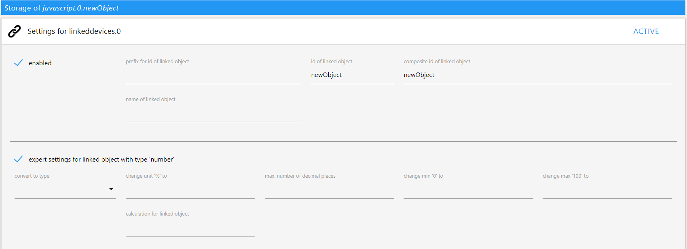
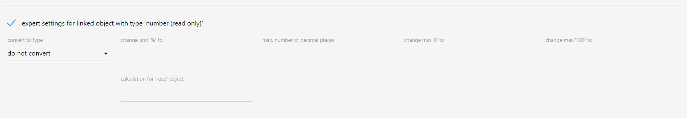
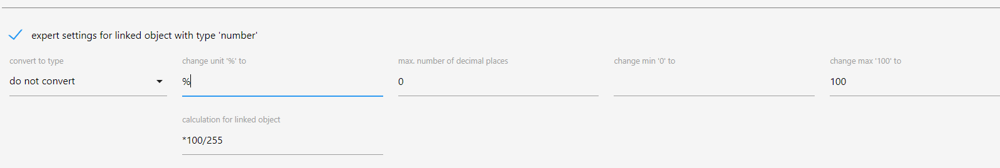
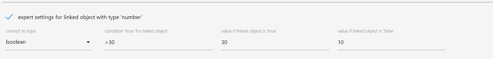

# ioBroker linkeddevices adapter

## Link the object (data point)
An object can be created via the `Settings` button in the `Object` menu.

> This button is only visible with history adapter installed!

## Object (data point) settings

The following basic settings must be made for the linked object:

|  input box | describtion  |
|---|---|
| enabled | activate object linking |
| prefix for id of linked object | Name to be prefixed with the ID of the linked object |
| id of linked object | ID of the linked object |
| composite id of linked object | Shows how the ID of the linked object will look like - Composition of *prefix for id of linked object* & *ID of the linked object*

Further settings:

|  input box | describtion  |
|---|---|
| name of linked object | Here you can specify a name for the linked objects |
| expert settings for linked object with type X | other settings that depend on the object type. ([Additional information below](#expert-settings-for-linked-object-with-type-x)) <ul><li>[number (readonly)](#expert-settings-for-linked-object-with-type-number-readonly)</li><li>[number](#expert-settings-for-linked-object-with-type-number)</li></ul> |

**Example:**  The inputs shown in the screenshot above generates the
following linked object:

## expert settings for linked object with type X

Depending on the object type (number, logic value, string, etc.) to be
linked, further settings such as calculations or conversions to a
different type can be set for the linked object.

### expert settings for linked object with type *number (readonly)*

#### number (readonly): do not convert

|  input box | describtion  | allowed input | example (see picture) |
|---|---|---|---|
| change unit '%' to | Set the unit for the linked object | no restriction | Object has unit 'kWh', linked object has unit 'Wh' |
| max. number of decimal places | set max. number of decimal places for linked object | numbers | Value of the object '100.561' results in the value '101' for the linked object |
| change min '0' to | minimum value allowed for the linked object | numbers | - |
| change max '100' to | maximum value that the linked object is allowed to accept | numbers | - |
| calculation for 'read' object | mathematical conversion of the object value | _+ - / *,. ()_ & *numbers* | Value of the object '279688.9' with conversion '/ 1000' indicates the value '280.6889' for the linked object |

#### number (readonly): condition 'true' for linked object

|  input box | describtion  | allowed input | example (see picture) |
|---|---|---|---|
| value if linked object is 'true' | Object value for which the linked object should be set to 'true' | *= != > < >= <=* + *numbers* | For values '> 100' of the object, the linked object is 'true' |

### expert settings for linked object with type 'number'

#### number: concert to type do not convert

|  input box | describtion  | allowed input | example (see picture) |
|---|---|---|---|
| change unit '%' to | Set the unit for the linked objec | keine Beschränkung | Objekt hat keine Einheit, verlinktes Objekt hat Einheit '%' |
| max. number of decimal places | set max. number of decimal places for linked object | numbers | Value of the object '100.561' results in the value '101' for the linked object |
| change min '0' to | minimum value allowed for the linked object | numbers | - |
| change max '100' to | maximum value that the linked object is allowed to accept | numbers | - |
| calculation for 'read' object | mathematical conversion of the object value  | _/ *,._ & *numbers* | Object value  '180' with conversion '* 100/255' indicates the value '71' for the linked object. Conversely, the reciprocal is formed in the calculation, that is, when the linked object has the value '71', the object has the value '180'.. This can e.g. used for Hue lamps to convert the range of values from '0-255' to '0% -100%' |

#### number: convert to type boolean

|  input box | describtion  | allowed input | example (see picture) |
|---|---|---|---|
| condition 'true' for linked object | Value of the object for which the linked object should be set to 'true' | *= != > < >= <=* + *numbers* | For values '> 30' of the object, the linked object is 'true' |
| value if linked object is 'true' | Value of the object if the linked object is true | numbers | If the linked object is set to 'true', the value of the object is '30' |
| value if linked object is 'false' | Value of the object if the linked object is false | numbers | If the linked object is set to 'false', the value of the object is '10' |

